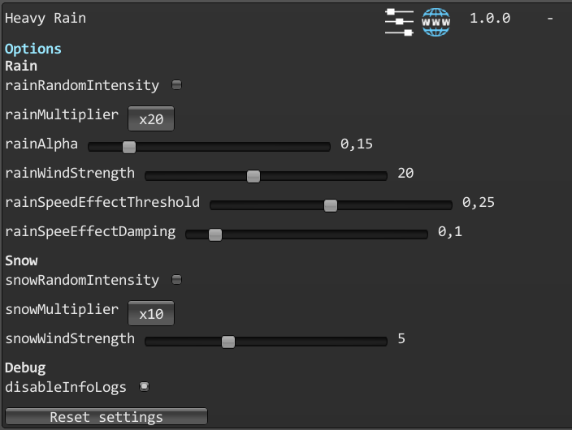

# Heavy Rain

A mod for Art of Rally which makes the rain and the snow effects stronger.

#### Launcher Support

#### Platform Support

## Usage

Press Ctrl + F10 to open the mod manager menu.\
Adjust settings to select the strength of the weather effects.\
By default, the mod increases the rain and snow effects and adds wind.

- **rainRandomIntensity** : will randomly set the rain multiplier on each rain level.
- **rainMultiplier** : will multiply the intensity of the rain.
- **rainAlpha** : will change the opacity of the rain effect.
- **rainWindStrength** : will change the strength of the wind applied to the rain.
- **rainSpeedEffectThreshold** : will change the speed at which the rain wind effect starts.
- **rainSpeedEffectDamping** : will change how dampened is the wind effect on the rain.

- **snowRandomIntensity** : will randomly set the snow multiplier on each snow level.
- **snowMultiplier** : will multiply the intensity of the snow.
- **snowWindStrength** : will change the strength of the wind applied to the snow.

- **disableInfoLogs** : will disable the logs for this mod in the console.
- **Reset settings** : will reset all the settings to their base value.

Disabling the mod in the manager will reset the rain and snow to their normal state.

## Disclaimer

Increasing the rain and snow effects might have a heavy impact on the performances.

## Installation

Follow the [installation guide](https://www.nexusmods.com/site/mods/21/) of
the Unity Mod Manager.\
Then simply download the [latest release](https://github.com/MMike17/ArtOfRally_HeavyRain/releases/latest)
and drop it into the mod manager's mods page.

## Showcase

